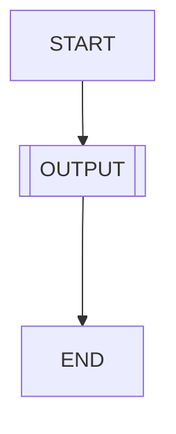
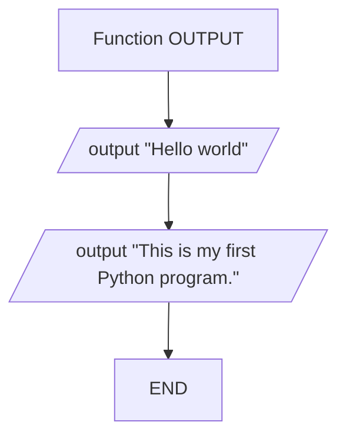

# [Programming Challenges](../README.md)

## 1. Hello World

Design and implement a program that displays the message 

```text
Hello World
This is my first Python program.
```

## Implement your program

### Testing

How do you know whether your program works?

```text
It will output "Hello world"
```
### Help

Follow these flowcharts to help with your code:

#### Main program



#### OUTOUT function


*If you require a little more help, use the following Parsons problem and move the statements into the correct sequence*

Parsons problem: <https://time2code.today/parsons/programs/hello_world/program.html>


### Code

Use the attached files to write your code / or copy and paste it in to:

- Python:

>[hello_world.py](hello_world.py)

### Commiting your code

Add a comment to explain what you have done, for example:


